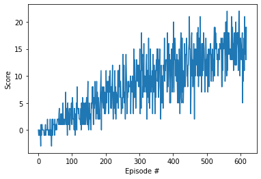

###Udacity Deep Reinforcement Learning Nanodegree
#Report : Navgation
In this project, the Deep Q-Network learning algorithm has been used to solve the Navigation problem.

###Deep Q-Network
Q-learning is a value-based Reinforcement Learning algorithm that is used to find the optimal action-selection policy using a q function, Q(s,a).

In Deep Q-learning we use neural networks to approximate action-state value. In this project I have used a neural network with two hidden layers with 64 neurons in each hidden layers. Input layer has 37 neurons for 37 states and output layer has 4 neurons corresponding to 4 actions the agent can take.

Unfortunately, when we use neural networks to represent action-values, the RL agent becomes very unstable.
Deep Q-learning addresses these instabilities by using two key features:
- Experience Replay
- Fixed Q-targets

####Experience Replay
When the agent interacts with the environment, the sequence of experience tuple van be highly correlated. So by storing the experience in the replay buffer and sing experience replay to sample from the buffer at random, we can prevent action-values from oscillating or diverging catastrophically.

####Fixed Q-target
In Q-learning we update a guess with a guess and this can potentially lead to harmful correlations. So here we use two networks, and uses only one for predicting. We fix the target network weights for a few learning steps before updating. Fixed Q-target help us decouple the moving target and the weight, resulting in a more stable learning environment.

In this project I have used both Experience Replay and Fixed Q-target with the agent.

###Learning algorithm:

- Initiate two neural networks with random weight: Local and Target
- Loop for number of episodes:
  - Initiate the agent in a random state
  - Loop for an episode:
    - Select an action using Epsilon Greedy policy on action values. 
      - (1-Epsilon)% times select maximum neural network output action
      - Epsilon% times select random action
    - Observe the new state, reward and done condition from the environment.
    - Save this experience in the replay buffer.
    - Train our Local neural network at every 4 steps.
    - Update the Target Q-network weights a bit.
    - Decrease Epsilon

####Hyperparameter:
- BUFFER_SIZE = int(1e5)  # replay buffer size
- BATCH_SIZE = 64         # minibatch size  
- GAMMA = 0.99            # discount factor
- TAU = 1e-3              # for soft update of target parameters
- LR = 5e-4               # learning rate 
- UPDATE_EVERY = 4        # how often to update the network
- eps_start=1.0
- eps_end=0.01
- eps_decay=0.995

###Result

Training logs
- Episode 100	Average Score: 0.94
- Episode 200	Average Score: 3.82
- Episode 300	Average Score: 7.67
- Episode 400	Average Score: 10.04
- Episode 500	Average Score: 12.23
- Episode 600	Average Score: 14.66
- Episode 618	Average Score: 15.02

Training graph:

####Conclusion: 
DQN algorithm solved the environment, achieved average 13 score in **518** episodes!	Average Score after 618 episode is **15.02**

###Ideas for Future Work
- This project used only the simple Deep Q-learning algorithm with Experience Replay and Fixed Q-target.
As a future work, more improved algorithms like double DQN, dueling DQN and prioritized Experince Replay can be applied to improve the overall performance.
- Some times agent gets confused and repeats the same actions few times before going other ways. This wastes some time, so we are not able to get maximum score. In a way it gets confused and goes in a loop. For future work I will try to find a way to solve that. 